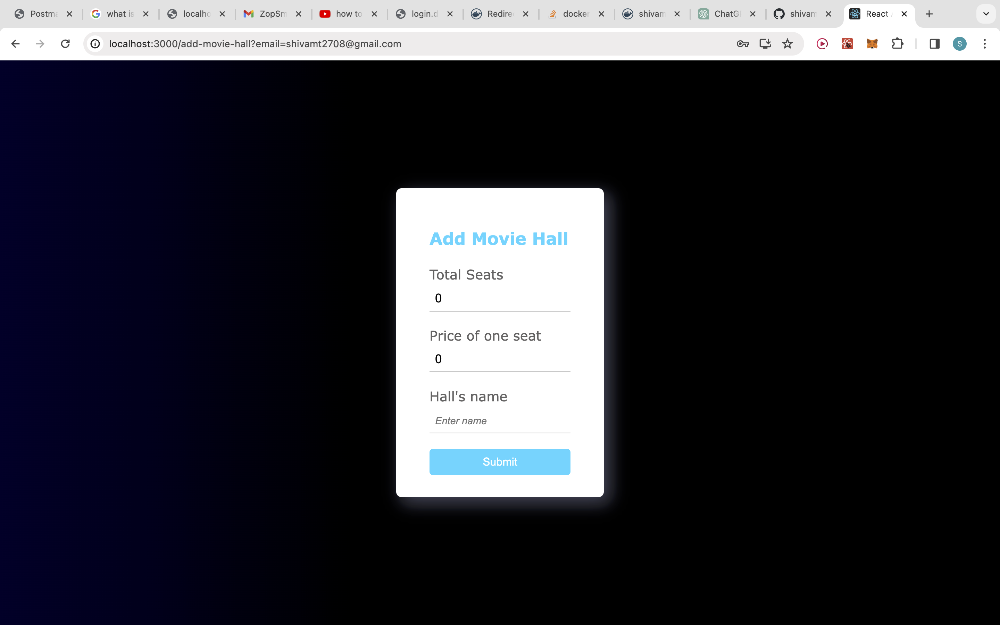
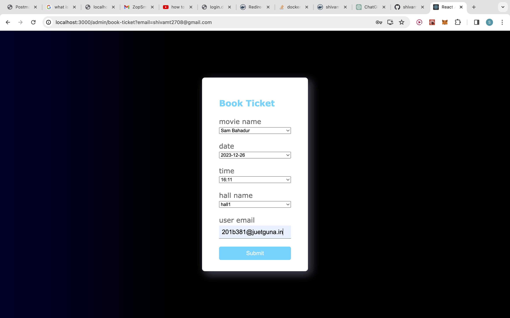
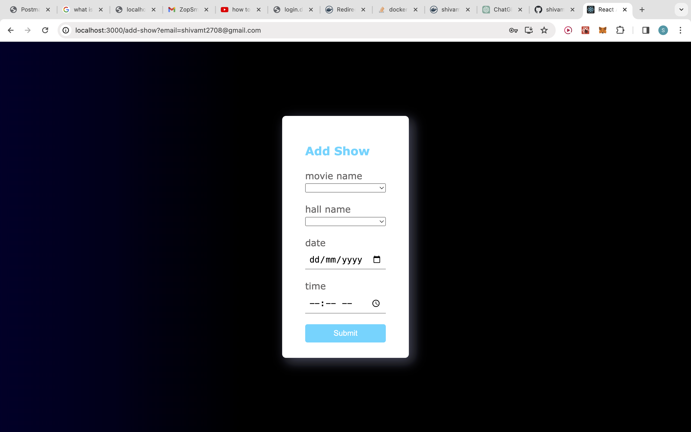
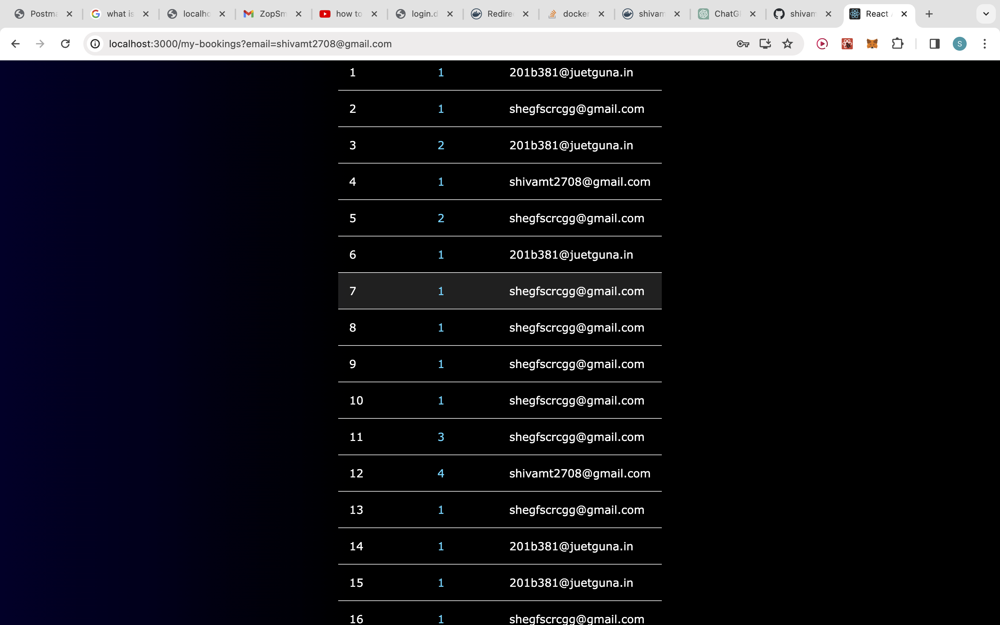
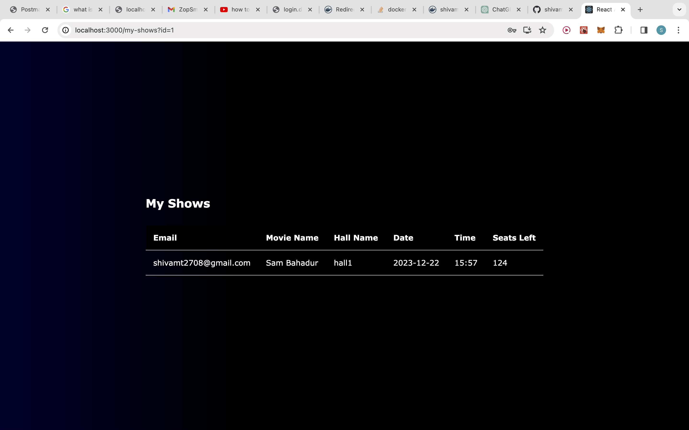
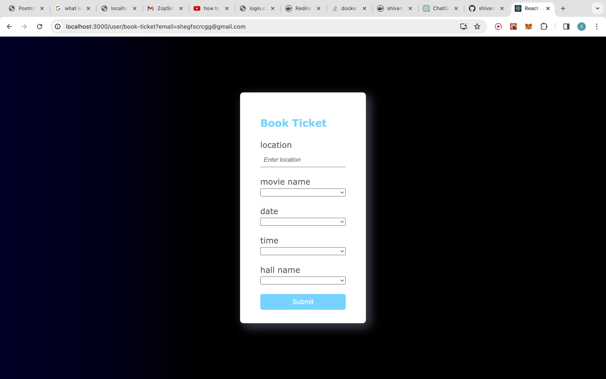
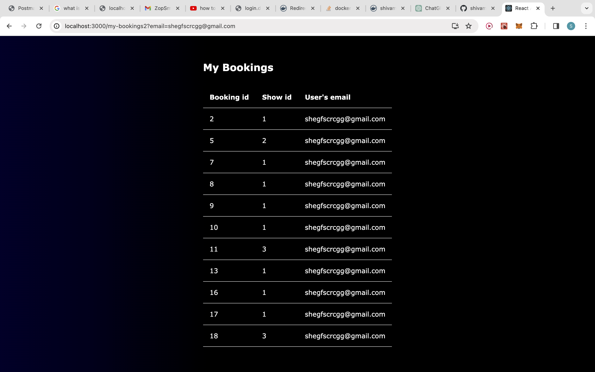

# movie_ticket_booking_GoFr
This is a web application whose backend is build on GoFr which is framework in golang and the frontend is build in reactjs.
basically there are 3 kinds of users:

# user: 
user is normal everyday user who can book movie tickets and see booking they have made.

# admin: 
admin is the supervisor of the cinema hall or theater and they can add movie hall, see there halls, book ticket, see the booking of the cinema hall, add shows for a movie and see the status of the shows (how much of the show is filled).

# super admin: 
they have only one one role adding a movie to a list.

# post man collection:
    

# Backend Setup:

# MYSQL Setup:

Step 1: Run the docker image:

    docker run --name gofr-mysql -e MYSQL_ROOT_PASSWORD=password -p 2001:3306 -d mysql:8.0.30

Step 2: create database,run this on path /zopsmart/gofr/examples/using-mysql:

    docker exec -i gofr-ssl-mysql mysql -u root -ppassword

# Run:

Step 2: Now run the example on path /zopsmart/gofr/examples/using-mysql by

go run main.go

# Frontend setup:

Step 1: Run the command:

    npm init

Step 2: Run the command:

    npm i

Step 3: Run the command:

    npm start

# Docker Image:

https://hub.docker.com/repository/docker/shivamt2708/movie_ticket_booking_gofr/general

# structure of the database:

## Halls Table

| Field       | Type         | Null | Key | Default | Extra |
|-------------|--------------|------|-----|---------|-------|
| email       | varchar(255) | NO   |     | NULL    |       |
| total_seats | int          | NO   |     | NULL    |       |
| price       | int          | NO   |     | NULL    |       |
| name        | varchar(255) | NO   | PRI | NULL    |       |

## Shows Table

| Field      | Type         | Null | Key | Default | Extra          |
|------------|--------------|------|-----|---------|----------------|
| id         | int          | NO   | PRI | NULL    | auto_increment |
| email      | varchar(255) | NO   |     | NULL    |                |
| movie_name | varchar(255) | NO   |     | NULL    |                |
| hall_name  | varchar(255) | NO   |     | NULL    |                |
| seats_left | int          | NO   |     | NULL    |                |
| date       | varchar(255) | NO   |     | NULL    |                |
| time       | varchar(255) | NO   |     | NULL    |                |

## Bookings Table

| Field      | Type         | Null | Key | Default | Extra          |
|------------|--------------|------|-----|---------|----------------|
| id         | int          | NO   | PRI | NULL    | auto_increment |
| show_id    | int          | YES  | MUL | NULL    |                |
| user_email | varchar(255) | NO   |     | NULL    |                |

## Users Table

| Field    | Type         | Null | Key | Default | Extra |
|----------|--------------|------|-----|---------|-------|
| email    | varchar(255) | NO   | PRI | NULL    |       |
| username | varchar(255) | NO   |     | NULL    |       |
| password | varchar(255) | NO   |     | NULL    |       |
| role     | varchar(255) | NO   |     | NULL    |       |
| location | varchar(255) | NO   |     | NULL    |       |

## Movies Table

| Field      | Type         | Null | Key | Default | Extra          |
|------------|--------------|------|-----|---------|----------------|
| id         | int          | NO   | PRI | NULL    | auto_increment |
| movie_name | varchar(255) | NO   |     | NULL    |                |

# Screen Shots:

